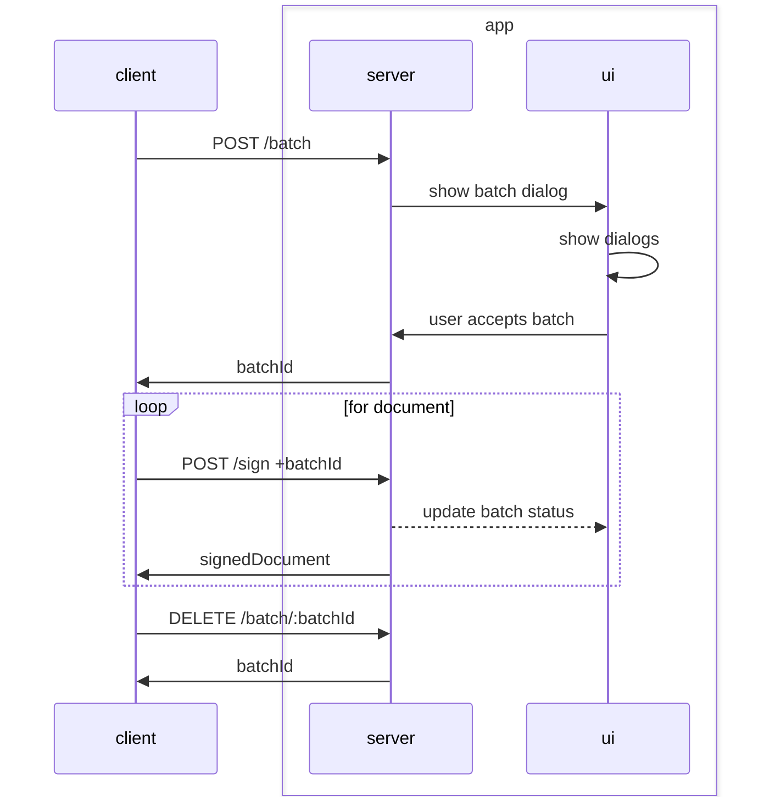
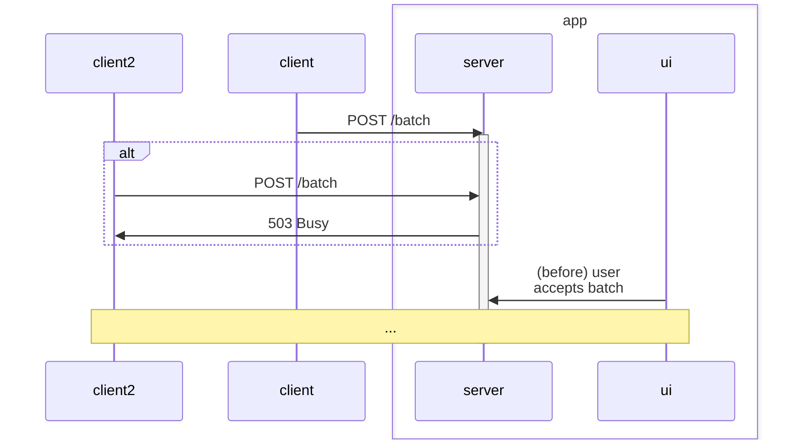

# Scenare hromadneho podpisovania

- id hromadneho podpisovania je zranitelna informacia, ak ju poznas vies podpisat hocico pocas behu batchu
- moze existovat iba jedno aktivne hromadne podpisovanie
- pocas hromadneho podpisovania sa nesmie dat zmenit token driver
- pocas behu hromadneho podpisovania ostatne sign requesty cakaju
- pocas behu hromadneho podpisovania su odmietane nove hromadne podpisovania (?)
- hromadne podpisovanie viem ako pouzivatel prerusit zatvorenim okna alebo stlacenim tlacidla
- je dolezite aby pri driveroch/klucoch ktore vyzaduju pin pri kazdom podpisani bola informacia o tomto (v nejakej zatvorke/malym sedym) 
- kym je aktivny session tak je otvorene okno (+ stav pred potvrdenim, po dokonceni)

## 1. Happy path

z pohladu klienta

- volanie `POST /batch` dostanem naspat `batchId`
- volanie `POST /sign` s `batchId` nastavenym, dostanem naspat
- volanie `DELETE /batch/:batchId` na ukoncenie podpisovania

z pohladu UI

- ukazat dialog o hromadnom podpisovani
- vybrat token driver (optional - ak nie je vybrany kluc)
- vybrat podpisovy kluc (optional)
- potvrdit spustenie hromadneho podpisovania s vybranym podpisom

## 2. Pouzivatel zrusi

### 2.1 zrusi vyber driveru

Okno vyberu driveru sa zatvori, moze ho spustit znova z batch dialogu

### 2.2 zrusi nezacate hromadne podpisovanie

(pred vybratou identitou alebo po)

Vrati sa error z `POST /batch` endpointu

### 2.3 zrusi aktivne hromadne podpisovanie

Vrati sa error z vsetkych `POST /sign` endpointov pre dany batch

## 3. Nastane chyba

### 3.1 chyba pocas vyberu driveru

Zatvori sa okno, pouzivatel bude mat moznost zopakovat vyber driveru.

### 3.2 chyba pocas podpisovania

Vrati sa chyba sign requestu.
(Ak je to chyba ktoru vieme opravit strojovo treba zvazit ci to chceme urobit - napr retry)

## 4. Pocas behu batchu

### 4.1 pride sign mimo batchu

Zobrazi sa okno s podpisovanim, s tym ze button je disabled, kym sa neskonci batch signing

### 4.2 pride novy batch request

Novy batch request bude odmietnuty.

### 4.2 pride novy batch request ked

